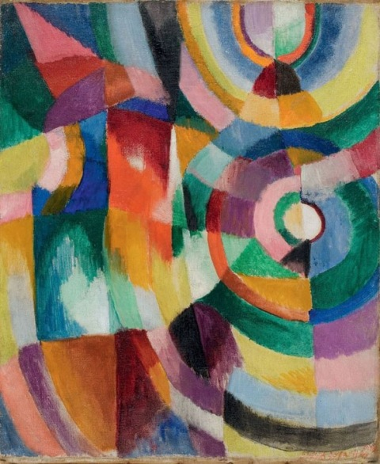

<h1 align = 'center'> Neural Style Transfer
</h1>

<!---
&emsp;&emsp;&emsp;&emsp;&emsp;&emsp;&emsp;&emsp;&emsp;&emsp;&emsp;&emsp;&emsp;&emsp;&emsp;&emsp;&emsp;&emsp;&emsp;&emsp;&emsp; 
--->

<h2 align='center'>
About 
</h2>

Neural style transfer is an optimization technique used to take two images, a content image, a style image and blend them such that the input image is transformed to look like the content image, but painted in the style of the style image.

-----------------------------------

<h2 align='center'>
Results 
</h2>

<h5>Content Image</h5>
  

<h5>Style Image</h5>
  

<h5>Generated Image</h5>
  

-----------------------------------

###             Tech stack
`Framework` : Tensorflow  
`Version` : 2.5.0  
`Tool Used` : Google Colab   

-----------------------------------

<h3 align="center"><b>Developed with :heart: by <a href="https://github.com/Aafiya-H">Aafiya</a> </b></h1>
